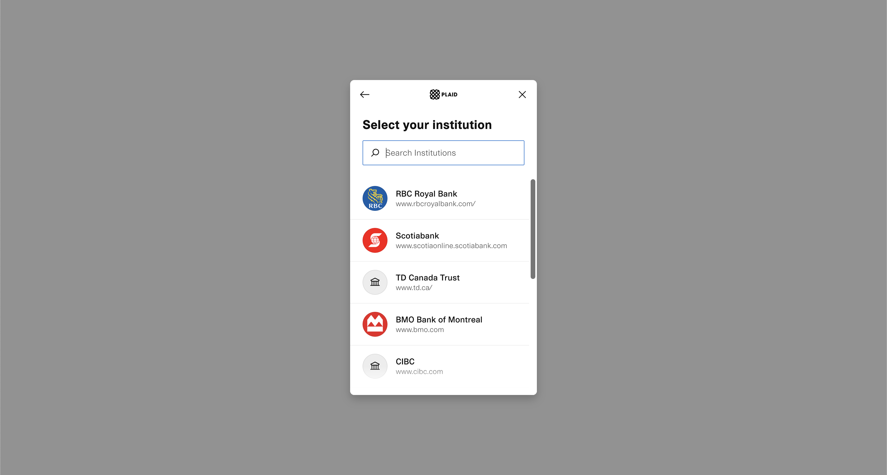
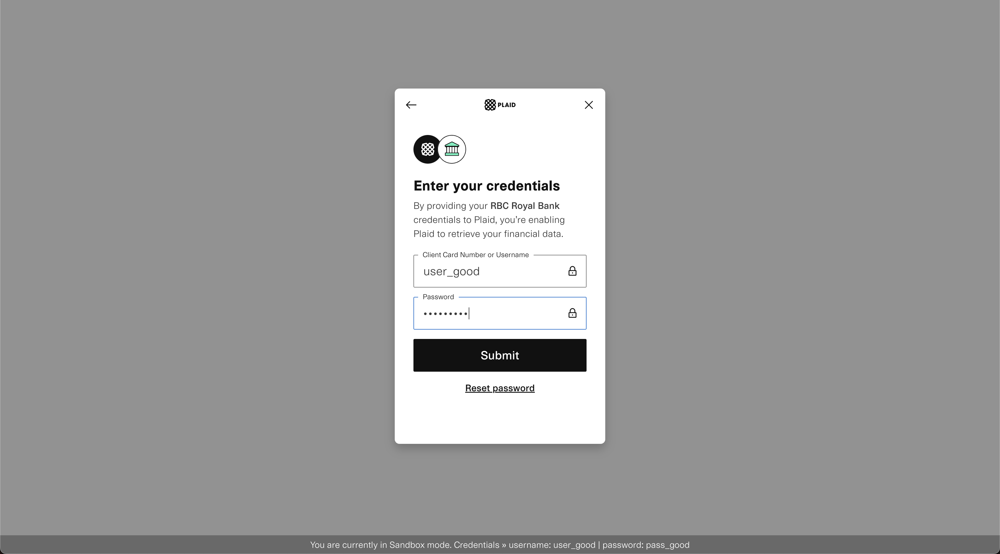
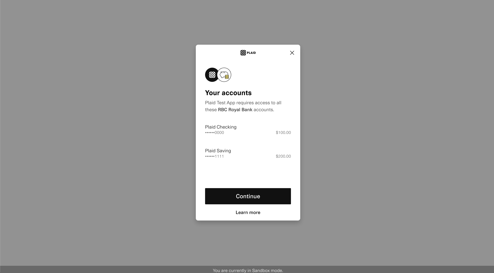
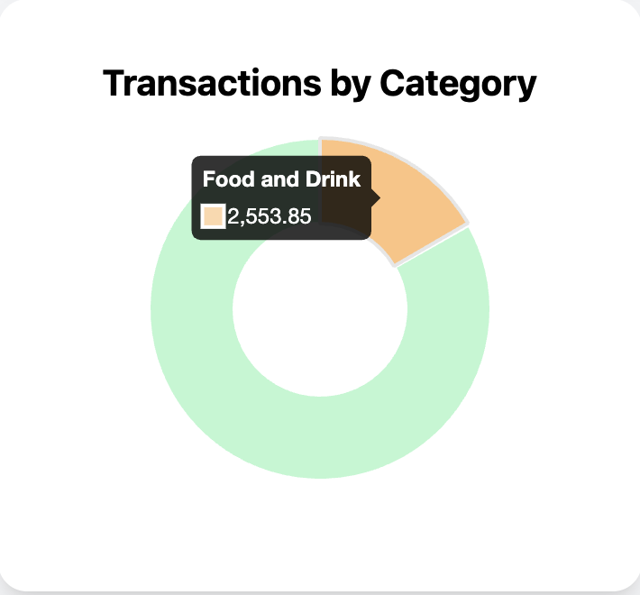
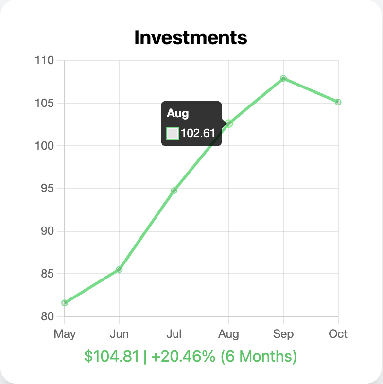

# FinBoard

A Financial Dashboard that Connects Directly to Your Accounts 💸 

Currently Works For All Major Canadian Institutions

Demo Mode Available to Public, Please Contact for Access to Development Mode

## Features

**Login**   
Login to the Website using Plaid API

Landing Page:


<div style="display: flex; flex-wrap: wrap;">
  
  
  
</div>

**View Transactional + Investments Data**  

Data is Categorized and Visualized

Payment Processing Feature Included


Responsive Charts

<div style="display: flex; flex-wrap: wrap;">
  
  
</div>


## Run Locally

**To run this project, you will need to add the following environment variables to your .env file**

`PLAID_CLIENT_ID`

`PLAID_CLIENT_SECRET`

'PLAID_ENV = "development"'

**These can be found in the Plaid API dashboard after creating a free account**:  

[Link to Plaid API Developer Site](https://plaid.com/)


**Clone the project**

```bash
  git clone https://github.com/RickLiu1203/FinBoard.git
```

**Go to the project directory**

```bash
  cd finboard
```

**Install dependencies**

```bash
  npm install
```

**Start the backend**  
```bash
  node ./lib/index.js
```

**Start the server**

```bash
  npm run dev
```

## Author

Made with 👂 by [@RickLiu1203](https://www.github.com/RickLiu1203)
